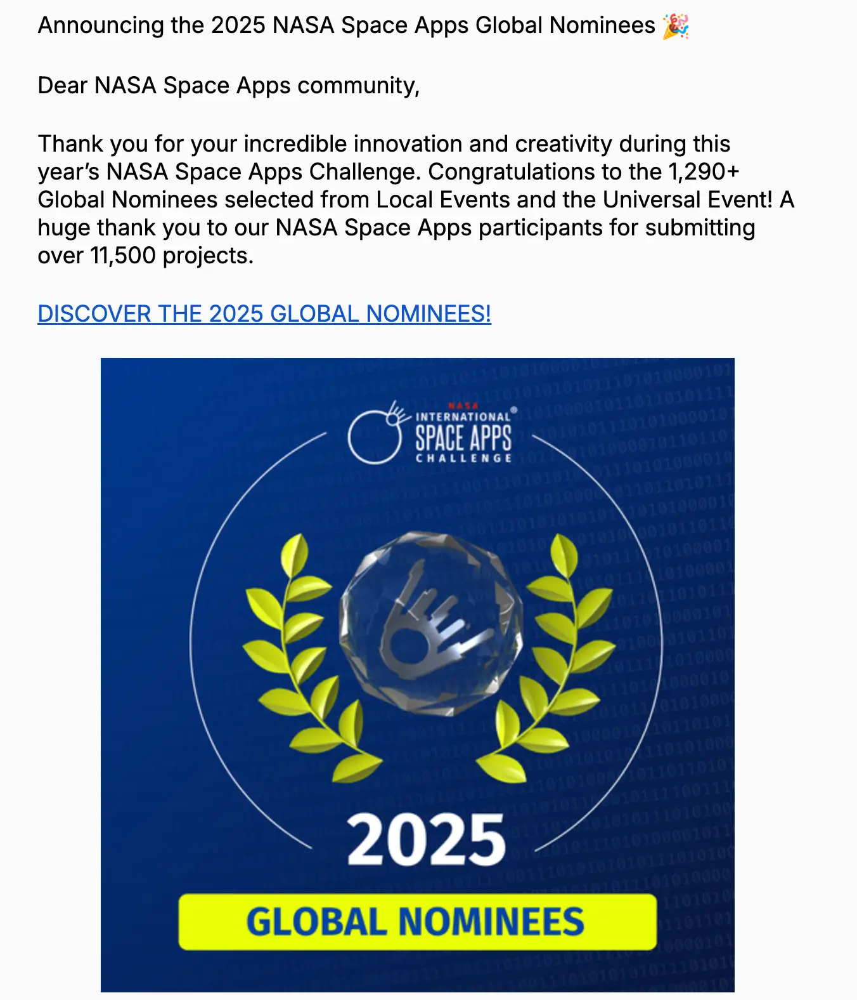
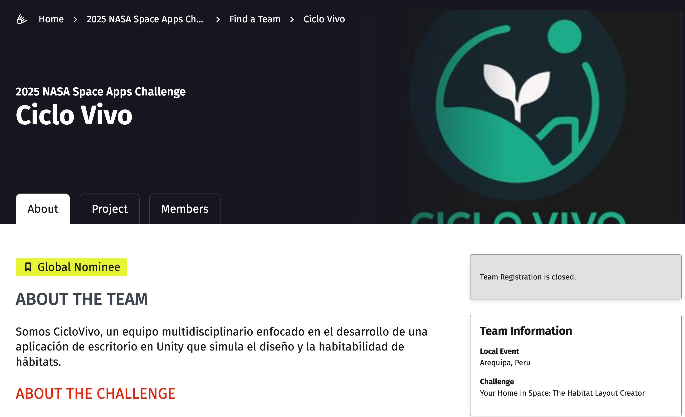

Ser nominado como **Global Nominee en el NASA Space Apps Challenge 2025** ha sido una de las experiencias más intensas, emocionantes y significativas de mi vida.  
Entre más de **11,500 proyectos enviados desde todo el mundo**, nuestro equipo logró entrar dentro del selecto grupo de **1,290+ nominados globales**, una distinción enorme considerando la magnitud del evento y el nivel de creatividad e innovación de los participantes.

---
## 🚀 El anuncio oficial

---

## 🧠 ¿Qué hicimos en el proyecto?

Participamos con un proyecto centrado en **diseño espacial, simulación y habitabilidad lunar**, integrando:

- Visualización en 3D  
- Cálculos de volumen y espacio vital  
- Diseño arquitectónico para hábitats lunares  
- Herramientas intuitivas para planificar módulos espaciales  

Una mezcla de programación, diseño, ingeniería y creatividad.

---

## ❤️ Agradecimiento personal

Este logro fue resultado de:

- Trabajo en equipo  
- Pasión total por el espacio y la tecnología  

Estoy increíblemente agradecido por esta oportunidad, por mi equipo y por todo lo que hemos aprendido en el camino.

---

## 🌕 Lo que sigue

La nominación global es solo el inicio.  
Este logro impulsa mis futuros proyectos relacionados con:

- Simulación espacial  
- Diseño de herramientas para exploración lunar  
- Visualización científica  
- Aplicaciones de ingeniería y software para misiones espaciales  

Y por supuesto, refuerza mi deseo de seguir participando en próximas ediciones del NASA Space Apps Challenge.

---
Gracias, NASA, por esta oportunidad.  
Gracias a mi equipo.  

🚀 **Vamos por más.**

---