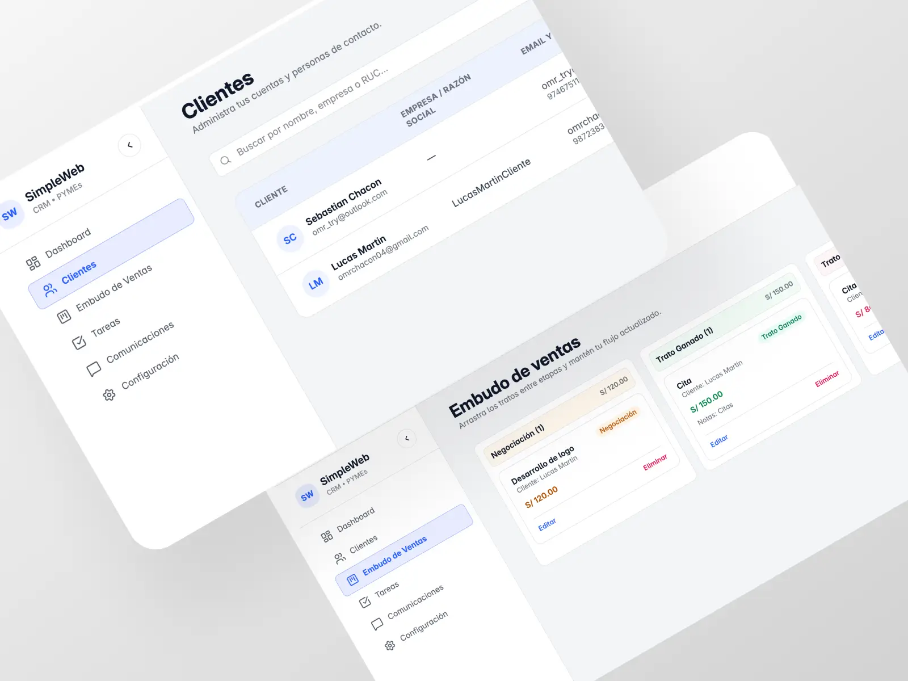
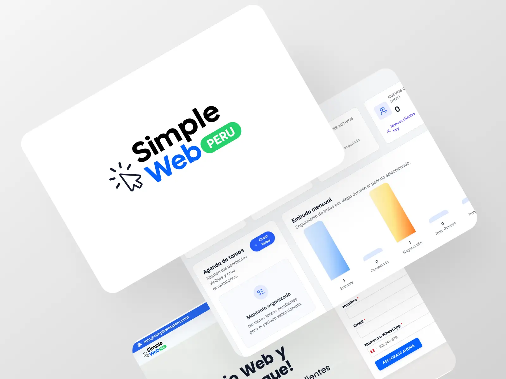

## Tabla de Contenidos
1. [Resumen General](#resumen-general)
2. [Rol en el Proyecto](#rol-en-el-proyecto)
3. [Problema](#problema)
4. [Objetivo](#objetivo)
5. [Solución](#solución)
- [¿Cómo gestionan clientes actualmente los negocios peruanos?](#cómo-gestionan-clientes-actualmente-los-negocios-peruanos)
- [¿Qué valoran más los usuarios?](#qué-valoran-más-los-usuarios)
- [Arquitectura técnica del CRM](#arquitectura-técnica-del-crm)
- [Recorrido del Usuario](#recorrido-del-usuario)
6. [Pruebas con Usuarios](#pruebas-con-usuarios)
7. [Retos y Aprendizajes](#retos-y-aprendizajes)
8. [Conclusiones Finales](#conclusiones-finales)

---

## Resumen General
**SimpleWeb CRM** es un sistema de gestión de clientes diseñado para centralizar contactos, formularios y mensajes provenientes de sitios web y WhatsApp.  
El objetivo principal es que los emprendedores y negocios peruanos **no pierdan clientes**, tengan control de sus ventas y logren un proceso más ordenado.

Incluye:

- Gestión de clientes y contactos  
- Pipeline simple para ventas  
- Formulario de captura conectado a las webs de SimpleWeb Perú  
- Integración con WhatsApp  
- Notificaciones y registro de cada acción  
- Autenticación segura con JWT  
- Hosting en AWS + Nginx + PM2  

---

## Rol en el Proyecto
**Diseño UI/UX**, **Desarrollo Frontend (React)**,  
**Desarrollo Backend (Node.js + Express)**,  
**Base de Datos (PostgreSQL)**,  
**DevOps e infraestructura en AWS**

---

## Problema
La mayoría de micro y pequeñas empresas en Perú gestionan sus clientes de manera informal:

1. Conversaciones desperdigadas en WhatsApp.  
2. Formularios que llegan al correo y se pierden.  
3. Sin historial del cliente ni seguimiento.  
4. Sin un sistema donde registrar ventas o oportunidades.  
5. Sin centralizar sus contactos en un solo lugar.  

Esto genera pérdida constante de clientes, falta de orden y cero análisis.

---

## Objetivo
1. Crear un CRM **simple, rápido y fácil de usar** incluso para usuarios sin experiencia.  
2. Centralizar todos los leads de una web en un solo lugar.  
3. Integrar WhatsApp como principal canal de contacto.  
4. Ofrecer un sistema escalable para que múltiples negocios puedan usarlo.  
5. Diseñar una interfaz minimalista y clara, sin complicaciones.

---

## Solución

### ¿Cómo gestionan clientes actualmente los negocios peruanos?
Tras entrevistas a usuarios reales:

- **72%** usa únicamente WhatsApp sin orden.  
- **20%** usa un Excel básico.  
- **8%** usa herramientas complicadas como HubSpot o Zoho.  

Todos coinciden en que esas herramientas son **demasiado complejas** para sus necesidades.

### ¿Qué valoran más los usuarios?
1. Interfaz clara y sin opciones innecesarias.  
2. Registro automático de leads provenientes de su web.  
3. Que el CRM sea rápido y fácil de usar.  
4. Integración directa con WhatsApp.  
5. Poder ver su historial de clientes en segundos.

### Arquitectura técnica del CRM
El sistema fue construido con un stack moderno:

- **Frontend:**  
  - React + Vite  
  - TailwindCSS  
  - Shadcn UI  
  - React Query  
- **Backend:**  
  - Node.js + Express  
  - JWT Auth  
  - Validación segura de endpoints  
- **Base de Datos:**  
  - PostgreSQL  
  - Tablas optimizadas para clientes, tareas y eventos  
- **Infraestructura:**  
  - AWS Lightsail  
  - Nginx reverse proxy  
  - PM2 para procesos  
  - Certificado SSL automático  

---

### Recorrido del Usuario
1. **Registro:** El usuario ingresa sus datos y crea su cuenta.  
2. **Dashboard:** Vista general de clientes recientes y métricas básicas.  
3. **Clientes:**  
   - Crear, editar o eliminar contactos  
   - Ver historial y notas  
4. **Entrantes desde la web:**  
   - Leads llegan automáticamente desde formularios SimpleWeb  
   - Se integran con WhatsApp en un clic  
5. **Tareas y seguimiento:** Registrar próximos pasos y recordatorios.  
6. **Configuración:**  
   - Datos del negocio  
   - Personalización ligera  

---

## Pruebas con Usuarios
Probado con 10 negocios reales:

- **9/10** dijeron que el CRM era mucho más fácil que HubSpot.  
- **10/10** entendieron la interfaz sin explicación previa.  

---

## Retos y Aprendizajes
1. Crear un CRM “simple” es difícil: lo simple requiere mucha iteración.  
2. Optimizar React + Vite para carga instantánea.  
3. Manejo de zonas horarias (Lima – UTC) en PostgreSQL.  
4. Asegurar endpoints con JWT y refresh tokens.  
5. Diseño minimalista que funcione incluso en pantallas pequeñas.  

---

## Conclusiones Finales
1. Las pequeñas empresas necesitan herramientas simples, no corporativas.  
2. Un CRM adecuado evita pérdida de clientes desde el primer día.  
3. La integración con WhatsApp es fundamental en Perú.  
4. La infraestructura en AWS permite estabilidad y escalabilidad.  
5. SimpleWeb CRM se convirtió en un producto clave dentro del ecosistema SimpleWeb Perú.

---