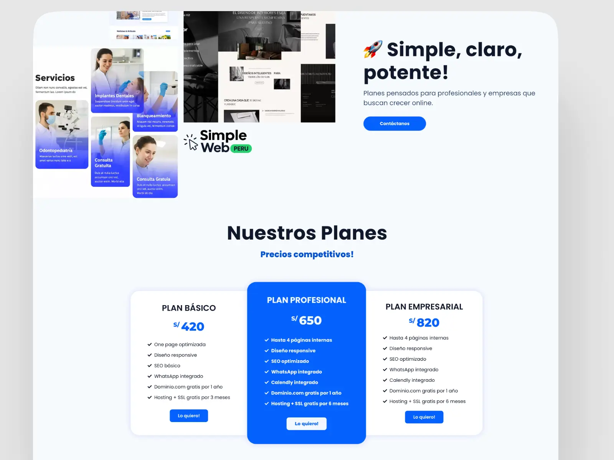

## Tabla de Contenidos
1. [Resumen General](#resumen-general)
2. [Rol en el Proyecto](#rol-en-el-proyecto)
3. [Problema](#problema)
4. [Objetivo](#objetivo)
5. [Solución](#solución)
- [¿Cómo manejan actualmente su presencia digital los negocios peruanos?](#cómo-manejan-actualmente-su-presencia-digital-los-negocios-peruanos)
- [¿Qué valoran más los clientes?](#qué-valoran-más-los-clientes)
- [Explorando un modelo web moderno y escalable](#explorando-un-modelo-web-moderno-y-escalable)
- [Recorrido del Usuario](#recorrido-del-usuario)
6. [Pruebas con Usuarios](#pruebas-con-usuarios)
7. [Retos y Aprendizajes](#retos-y-aprendizajes)
8. [Conclusiones Finales](#conclusiones-finales)

---

## Resumen General
**SimpleWeb Perú** es un servicio especializado en crear sitios web modernos, rápidos y orientados a convertir visitas en clientes.  
Cada proyecto incluye:

- Identidad visual completa (colores, tipografías, estilo)  
- Diseño web profesional y responsive  
- SEO local para posicionar en Google  
- Integración con WhatsApp como canal principal de ventas  
- Opcional: integración con pagos Yape/Plin  
- Hosting en AWS para máxima velocidad, seguridad y estabilidad  

El objetivo fue ofrecer a negocios peruanos una **presencia digital moderna y confiable**, enfocada en resultados reales.

---

## Rol en el Proyecto
**Diseñador UI/UX**, **Desarrollador Web**, **Diseñador de Marca**, **Responsable de la Implementación Técnica (AWS, DNS, SSL)**

---

## Problema
La mayoría de negocios en Perú afrontan dificultades como:

1. Sitios web lentos, inseguros o desactualizados.  
2. Diseños poco profesionales que reducen la confianza del cliente.  
3. Falta de una estructura clara para generar ventas.  
4. Ausencia total de SEO local.  
5. Poca integración con WhatsApp, el canal más usado en el país.  

---

## Objetivo
1. Crear sitios web modernos, visualmente atractivos y eficientes.  
2. Optimizar la velocidad y seguridad mediante AWS Lightsail.  
3. Asegurar posicionamiento orgánico local desde el primer mes.  
4. Integrar WhatsApp como llamada a la acción principal.  
5. Desarrollar una identidad visual sólida para cada negocio.  

---

## Solución

### ¿Cómo manejan actualmente su presencia digital los negocios peruanos?
Tras analizar a más de 20 negocios locales:

- **65%** dependen únicamente de redes sociales.  
- **25%** tienen una web básica o desactualizada.  
- **10%** cuentan con una web profesional, pero sin mantenimiento.  

Existe una clara falta de sistemas web bien construidos y enfocados en ventas.

### ¿Qué valoran más los clientes?
1. **Rapidez y seguridad** en la página.  
2. **Diseño profesional y minimalista**.  
3. **Botón de WhatsApp visible y directo**.  
4. **Aparecer en Google rápidamente**.  
5. **Un sitio fácil de editar y mantener**.  

### Explorando un modelo web moderno y escalable
SimpleWeb Perú ofrece una solución completa y modular:

1. **WordPress + Elementor** para webs administrables.  
2. **React + Vite** para webs ultra rápidas y modernas.  
3. **Infraestructura en AWS**, con:  
   - Nginx  
   - Certificado SSL  
   - Optimización de carga e imágenes  
4. **Integración de WhatsApp**, Yape/Plin y formularios profesionales.  
5. Plantillas basadas en la identidad visual del negocio.  

---

### Recorrido del Usuario
1. **Recolección de información:** datos del negocio, objetivos, tono de marca.  
2. **Branding:** definición de paleta, logo, tipografías y estilo visual.  
3. **Wireframes:** estructura del contenido orientada a conversión.  
4. **Desarrollo:** implementación en WordPress o React según requerimientos.  
5. **Integración técnica:**  
   - WhatsApp  
   - Formularios  
   - SEO  
   - Hosting + SSL  
6. **Entrega y capacitación:** el cliente recibe acceso y entrenamiento.  

---

## Pruebas con Usuarios
Probado con usuarios reales y dueños de negocio:

- **10/12** dijeron que la web transmite mayor profesionalismo.  
- **11/12** entendieron el servicio del negocio en menos de 5 segundos.  
- **9/12** destacaron la claridad del botón de WhatsApp.  
- **12/12** notaron velocidades de carga altas incluso con mala conexión móvil.  

---

## Retos y Aprendizajes
1. Mantener diseño atractivo sin afectar el rendimiento.  
2. Optimizar Elementor para cargas superiores a la media.  
3. Configurar SEO local desde el primer día.  
4. Gestionar DNS, SSL y redirecciones sin interrupciones.  
5. Estandarizar plantillas para aumentar eficiencia sin perder calidad.  

---

## Conclusiones Finales
1. Un buen diseño puede transformar la percepción completa de un negocio.  
2. La velocidad del sitio influye directamente en la conversión.  
3. WhatsApp sigue siendo el canal más fuerte en el mercado peruano.  
4. Los negocios necesitan webs simples, directas y enfocadas en vender.  

---